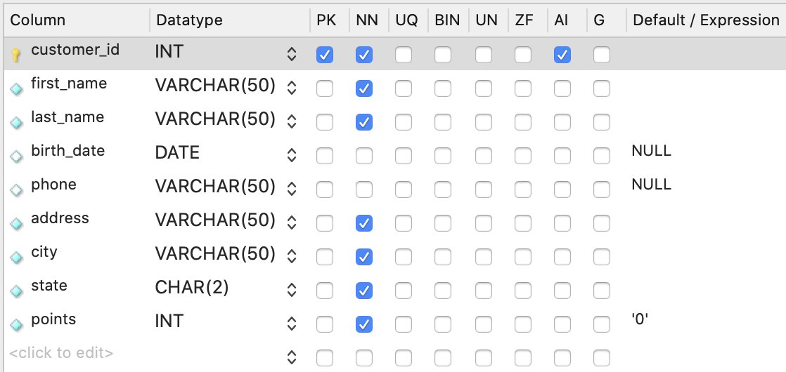
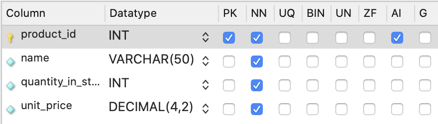
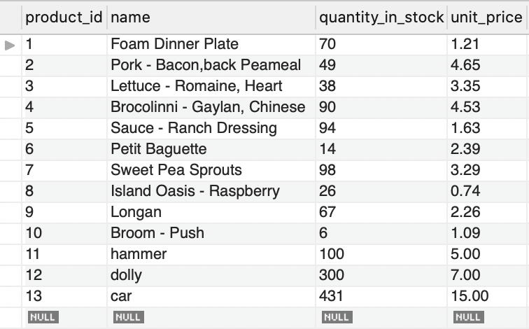
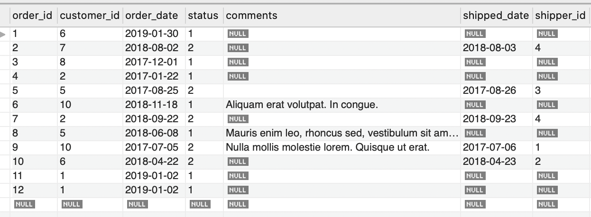
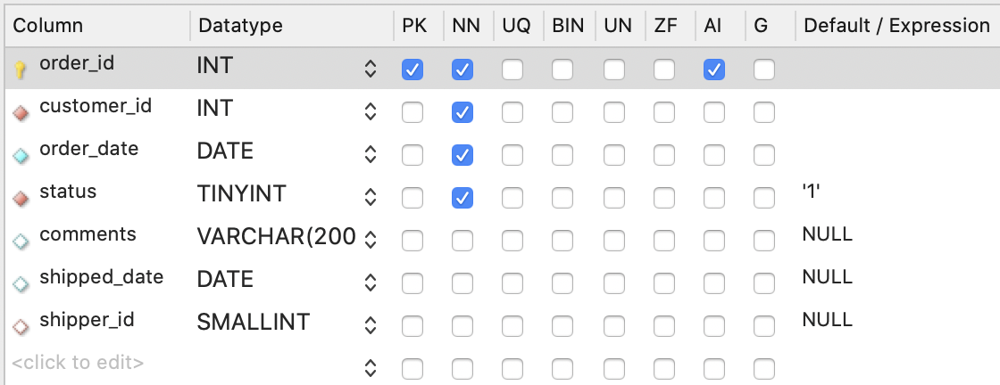
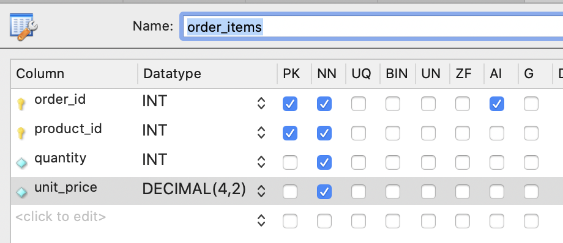

# SQL cheat sheet

[Youtube Tutorial - MySQL Tutorial for Beginners](https://www.youtube.com/watch?v=7S_tz1z_5bA&ab_channel=ProgrammingwithMosh)

## LIKE
Return customers born between 1/1/1990 and 1/1/2000
```
SELECT *
FROM customers
WHERE birth_date BETWEEN '1990-01-01' AND '2000-01-01'
```

## REGEXP
```
SELECT *
FROM customers
WHERE first_name REGEXP 'ELKA|AMBUR'
WHERE last_name REGEXP 'EY$|ON$'
WHERE last_name REGEXP '^MY|SE'
WHERE last_name REGEXP 'B[RU]'
WHERE last_name REGEXP 'BR|BU'
```

## ORDER BY
order rows by largest total price
```
SELECT *, quantity * unit_price AS total_price
FROM order_items
WHERE order_id = 2
ORDER BY total_price DESC
```

## Inner Join
Inner Join - Join 2 tables and set the customer ids from orders and customers table to be matching on the same row.

Inner is optional, it can be written either `JOIN` or `INNER JOIN`
```
--- EXAMPLE 1

SELECT
  order_id,
  o.customer_id,
  first_name,
  last_name,
  c.customer_id
FROM orders o
JOIN customers c
  ON o.customer_id = c.customer_id  
```

```
--- EXAMPLE 2

SELECT order_id, oi.product_id, name, quantity, oi.unit_price
FROM order_items oi
JOIN products p
ON oi.product_id = p.product_id
```

## Joining tables across databases
```
USE sql_inventory;
SELECT * FROM sql_store.order_items oi
JOIN products p
ON oi.product_id = p.product_id
```

## Self joins
Useful when we want to join tables by itself to display info from the same table showing only columns we want.
```
USE sql_hr;
SELECT
  e.employee_id,
  e.first_name,
  e.last_name,
  m.employee_id,
  m.first_name AS manager
FROM employees e
JOIN employees m
ON e.reports_to = m.employee_id
```

## Join more than 2 tables
```
--- EXAMPLE 1

USE sql_store;
SELECT
  o.order_id,
  o.order_date,
  c.first_name,
  c.last_name,
  os.name AS status
FROM orders o
JOIN customers c
  ON o.customer_id = c.customer_id
JOIN order_statuses os
  ON o.status = os.order_status_id
```

```
--- EXAMPLE 2

-- date, invoice_id, amoutn, client name, payment method name
USE sql_invoicing;
SELECT date, p.invoice_id, i.payment_total, c.name, pm.name
FROM payments p
JOIN clients c
  ON p.client_id = c.client_id
JOIN payment_methods pm
 ON pm.payment_method_id = p.payment_method
JOIN invoices i
  ON p.invoice_id = i.invoice_id
```
  
## Compound join conditions
This doesnt work :/ Need to find another example
```
USE sql_store;
SELECT *
FROM order_items oi
JOIN order_items_notes oin
  ON oi.order_id = oin.order_id
  AND oi.product_id = oin.product_id
```
  
## Implicit join syntax
Combine tables in FROM, and add WHERE instead of ON
```
SELECT *
FROM orders o, customers c
WHERE o.customer_id = c.customer_id
```

## Outer joins - LEFT, RIGHT
Can be written either `LEFT JOIN` or `RIGHT JOIN`.

Useful when you need to return records that doesn't completely match the `ON` condition.

2 types of OUTER joins, `RIGHT` and `LEFT`.

`LEFT JOIN` returns all the records from the left table (ie customers) regardless of the ON condition. It will return all customers even if they don't have order_id .

`RIGHT JOIN` returns all the records from the right table (ie orders) regardless of the ON condition.

```
--- EXAMPLE 1

SELECT 
  c.customer_id,
  c.first_name,
  o.order_id
-- FROM customers c LEFT JOIN orders o
-- FROM orders o RIGHT JOIN customers c
FROM customers c RIGHT JOIN orders o
  ON o.customer_id = c.customer_id
ORDER BY c.customer_id
```

```
--- EXAMPLE 2

SELECT
  p.product_id,
  p.name,
  oi.quantity
FROM products p
LEFT JOIN order_items oi
  ON p.product_id = oi.product_id
ORDER BY p.product_id
```

## OUTER joins between multiple tables
```
--- EXAMPLE 1

SELECT
  c.customer_id,
  c.first_name,
  o.order_id,
  sh.name AS shipper
FROM customers c
LEFT JOIN orders o
  ON c.customer_id = o.customer_id
LEFT JOIN shippers sh
  ON o.shipper_id = sh.shipper_id
ORDER BY c.customer_id
```

```
--- EXAMPLE 2

SELECT
  o.order_id,
  o.order_date,
  c.first_name,
  sh.name AS shipper,
  os.name AS status
FROM orders o
JOIN customers c
  ON o.customer_id = c.customer_id
LEFT JOIN shippers sh
  ON o.shipper_id = sh.shipper_id
JOIN order_statuses os
  ON o.status = os.order_status_id
ORDER BY o.order_id
```

## Self outer joins
`LEFT JOIN` here will get EVERY employee from the `employees e` table whether they have a manager or not.
```
USE sql_hr;
SELECT 
  e.employee_id,
  e.first_name,
  m.first_name AS manager
FROM employees e
LEFT JOIN employees m
  ON e.reports_to = m.employee_id
```

## USING clause
Useful when column names are exactly the same across tables.

`USING (customer_id)` is the same as `ON o.customer_id = c.customer_id`.
```
--- EXAMPLE 1

USE sql_store;
SELECT
  o.order_id,
  c.first_name,
  sh.name AS shipper
FROM orders o
JOIN customers c
-- ON o.customer_id = c.customer_id
  USING (customer_id)
LEFT JOIN shippers sh
  USING (shipper_id)
```

```
--- EXAMPLE 2

USE sql_invoicing;
SELECT 
  p.date,
  c.name AS client,
  p.amount,
  pm.name AS 'payment method'
FROM payments p
JOIN payment_methods pm
  ON p.payment_method = pm.payment_method_id
JOIN clients c
  USING (client_id)
```

## Natural JOINS
This is dangerous because we are letting MySQL to work out the columns itself.

Natural joins will join them based on common columns (columns with same name).
```
USE sql_store;
SELECT 
  o.order_id,
  c.first_name
FROM orders o
NATURAL JOIN customers c
```

## CROSS join
Explicit syntax - `CROSS JOIN`

Implicit syntax - multiple tables in `FROM`

Combine every record in the first table with ever record in the second table.

Useful when you have table of sizes ('small', 'medium', 'large') and table of colours ('red', 'green', 'yellow') and want to combine them.
```
--- EXAMPLE 1

USE sql_store;
SELECT 
  c.first_name AS customer,
  p.name AS product
FROM customers c
CROSS JOIN products p
ORDER BY c.first_name
```

```
--- EXAMPLE 2

USE sql_store;
SELECT 
  sh.name AS shipper,
  p.name AS product
-- implicit
FROM shippers sh, products p
-- explicit
-- FROM shippers sh
-- CROSS JOIN products p
ORDER BY sh.name
```

## UNIONS
Combine records/results from multiple queries
```
--- EXAMPLE 1

USE sql_store;
SELECT 
  order_id,
  order_date,
  'Active' AS status
FROM orders o
WHERE order_date >= '2019-01-01'
UNION
SELECT 
  order_id,
  order_date,
  'Archived' AS status
FROM orders o
WHERE order_date < '2019-01-01'
```

```
--- EXAMPLE 2

USE sql_store;
SELECT 
  customer_id,
  first_name,
  points,
  'Bronze' AS type
FROM customers
WHERE points < 2000
UNION
SELECT 
  customer_id,
  first_name,
  points,
  'Silver' AS type
FROM customers
WHERE points BETWEEN 2000 AND 3000
UNION
SELECT 
  customer_id,
  first_name,
  points,
  'Gold' AS type
FROM customers
WHERE points > 3000
ORDER BY first_name
```

## Insert a single row

`INT` integer

`VARCHAR(50)` maximum 50 characters. If less than 50 characters, it will only take up the space needed. E.g. `Teddy` takes up only 5 spaces. Use `VARCHAR` over `CHAR`

`CHAR(50)` maximum 50 characters. If less than 50 characters, it will still take up all 50 spaces.



Here we are inserting 1 row into the customers table.

The first `DEFAULT` is for the primary key `customer_id` which will auto increment (`AI` is checked).

The others that have values e.g. `'John', 'Smith'` must be provided because they are `NN` which means NOT NULL. So you cannot pass `null`.

If the column is marked optional (`NN` is not checked, then `DEFAULT` or `NULL` can be passed in).

The last `DEFAULT` will assign that column the default value, in this case it's `0`. 

```
-- EXAMPLE 1

INSERT INTO customers
VALUES (
  DEFAULT,
  'John',
  'Smith',
  '1990-01-01',
  NULL,
  '1 address',
  'Sydney',
  'NSW',
  DEFAULT
)
```


In example 2, we can optionally declare what values we want to supply in `INSERT INTO` with `()`. This allows us to add values without having to include `DEFAULT` or `NULL` to columns we have no values for. This also allows us to change the order of the columns e.g. we swapped `last_name` and `first_name`.
```
-- EXAMPLE 2

INSERT INTO customers (
  last_name,
  first_name,
  birth_date,
  address,
  city,
  state
)
VALUES (
  'Smith',
  'John',
  '1990-01-01',
  '1 address',
  'Sydney',
  'NSW'
)
```


## Insert multiple rows

```
-- EXAMPLE 1

INSERT INTO shippers (name)
VALUES ('Shipper1'),
	     ('Shipper2'),
       ('Shipper3')
```



```
-- EXAMPLE 2
INSERT INTO products (name, quantity_in_stock, unit_price)
VALUES ('hammer', 100, 5.00),
       ('dolly', 300, 7.00),
       ('car', 431, 15.00)
```


## Insert hierarchical rows - insert into multiple tables

Orders table:


Orders attributes table:


Order items attributes:


In orders items attributes, there is 2 primary keys. To get the primary key of `order_id`, we use `LAST_INSERT_ID()` to get the id that was last inserted (which is the `order_id` from the `orders` table). We manually set the `product_id`.
```
INSERT INTO orders (customer_id, order_date, status)
VALUES (1, '2019-01-02', 1);

INSERT INTO order_items
VALUES (LAST_INSERT_ID(), 1, 1, 2.95),
	     (LAST_INSERT_ID(), 2, 1, 3.95)
```

## Create a copy of a table

The first block of SQL query copies everything (including columns and data) from the `orders` table. It will create a new table `orders_archived` and will have all the data from `orders` table. Right click on `orders_archived` and `truncate table` to delete all data from the table. Then run the 2nd query block. This will add orders that were created before `1st Jan 2019`.

```
CREATE TABLE orders_archived AS
SELECT * FROM orders;

INSERT INTO orders_archived
SELECT *
FROM orders
WHERE order_date < '2019-01-01'
```


In second example, we are creating a new table `invoices_archived` by getting data from tables `invoices` and `clients`. 

We join the `invoices` and `clients` table and match up the data `USING (client_id)`. We also only want to show rows that have a `payment_date`.

Then we describe which columns we want from the two tables in the `SELECT` clause.

Finally, we add `CREATE TABLE invoices_archived AS` to create the table with the following query.

If this block of query is run more than once, it'll throw error. You'll need to drop the `invoices_archived` table to run the query again.
```
-- EXMAPLE 2

USE sql_invoicing;
CREATE TABLE invoices_archived AS
SELECT
  i.invoice_id,
  i.number,
  c.name AS client,
  i.invoice_total,
  i.payment_total,
  i.invoice_date,
  i.payment_date,
  i.due_date
FROM invoices i
JOIN clients c
  USING (client_id)
WHERE i.payment_date IS NOT NULL
```

## Updating a single Row

```
-- EXAMPLE 1

UPDATE invoices
SET payment_total = 10, payment_date = '2019-03-01'
WHERE invoice_id = 1

-- EXAMPLE 2

UPDATE invoices
SET payment_total = DEFAULT, payment_date = NULL
WHERE invoice_id = 1

// In example 3, we are using the data from the columns of the invoices table.

-- EXAMPLE 3

UPDATE invoices
SET 
  payment_total = invoice_total * 0.5,
  payment_date = due_date
WHERE invoice_id = 3
```

## Updating multiple rows

MySQL workbench will throw error if trying to update multiple rows. This can disabled through `Preferences`.

Open `MYSQLWorkbench` > `Preferences` > `SQL Editor` > scroll down and uncheck `Safe Updates (rejects UPDATEs and DELETEs with no restrictions)` > 'OK'

Restart your local database to have above changes take into effect.

```
// Example 1 will update all rows that have `client_id = 3`

-- EXAMPLE 1

USE sql_invoicing;
UPDATE invoices
SET 
  payment_total = invoice_total * 0.5,
  payment_date = due_date
WHERE client_id = 3

// Example 2 wll update all rows that have client_id of 3, 4

-- Example 2

USE sql_invoicing;
UPDATE invoices
SET 
  payment_total = invoice_total * 0.5,
  payment_date = due_date
WHERE client_id IN (3, 4)

-- Example 3

USE sql_store;
UPDATE customers
SET 
  points = points + 50
WHERE birth_date < '1990-01-01'
```